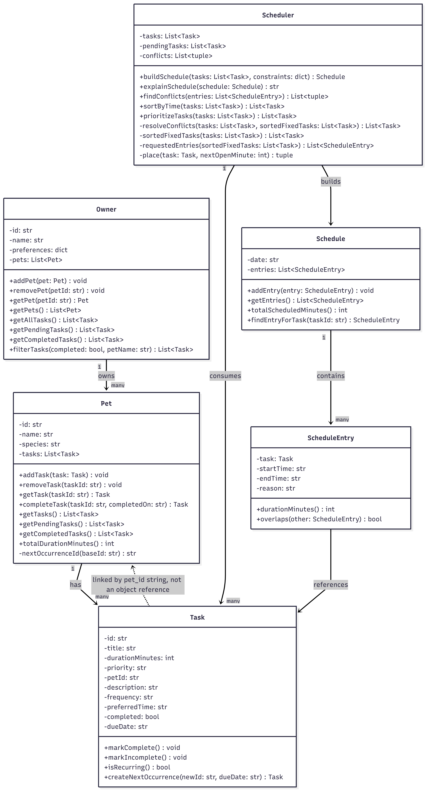

# PawPal+ (Module 2 Project)

You are building **PawPal+**, a Streamlit app that helps a pet owner plan care tasks for their pet.

## Scenario

A busy pet owner needs help staying consistent with pet care. They want an assistant that can:

- Track pet care tasks (walks, feeding, meds, enrichment, grooming, etc.)
- Consider constraints (time available, priority, owner preferences)
- Produce a daily plan and explain why it chose that plan

Your job is to design the system first (UML), then implement the logic in Python, then connect it to the Streamlit UI.

**UML Diagram**


## System Overview

- **Owner** — represents the pet owner: identifying info (`id`, `name`, `preferences`) and a list of `Pet`s. Owns cross-pet queries like `get_all_tasks` and `filter_tasks`, but holds no scheduling logic itself.
- **Pet** — represents one animal: identifying info (`id`, `name`, `species`) and its own list of `Task`s, with methods to add/remove/look up/complete tasks and split them into pending vs. completed.
- **Task** — a data-only unit of pet care (title, duration, priority, preferred time, frequency, due date, completion state) with a back-reference (`pet_id`) to the pet it belongs to. Knows how to mark itself complete/incomplete and spawn its next occurrence if it recurs.
- **Scheduler** — the only class with real algorithmic behavior. Takes a flat list of `Task`s (pulled across every pet) plus a constraints dict, and produces a `Schedule`: sorting/prioritizing tasks, detecting and resolving time conflicts, respecting due dates and a time budget, and explaining its choices.
- **Schedule / ScheduleEntry** — separate "what a task is" from "when and why it happens today." Each `ScheduleEntry` pairs a `Task` with a start/end time and a reason, without mutating the `Task` itself.

## What you will build

Your final app should:

- Let a user enter basic owner + pet info
- Let a user add/edit tasks (duration + priority at minimum)
- Generate a daily schedule/plan based on constraints and priorities
- Display the plan clearly (and ideally explain the reasoning)
- Include tests for the most important scheduling behaviors

## Getting started

### Setup

```bash
python -m venv .venv
source .venv/bin/activate  # Windows: .venv\Scripts\activate
pip install -r requirements.txt
```

### Suggested workflow

1. Read the scenario carefully and identify requirements and edge cases.
2. Draft a UML diagram (classes, attributes, methods, relationships).
3. Convert UML into Python class stubs (no logic yet).
4. Implement scheduling logic in small increments.
5. Add tests to verify key behaviors.
6. Connect your logic to the Streamlit UI in `app.py`.
7. Refine UML so it matches what you actually built.

## 🖥️ Sample Output

Paste a sample of your app's CLI or Streamlit output here so a reader can see what a generated plan looks like:

```
Today's Schedule
========================================
Schedule for 2026-07-05:
  08:00-08:30  Morning walk - honoring preferred time
  08:45-08:55  Feeding - honoring preferred time
  09:15-09:30  Litter box cleaning - honoring preferred time
```

## 🧪 Testing PawPal+

```bash
# Run the full test suite:
python -m pytest ai110-module2show-pawpal-starter\tests\test_pawpal.py
Test Descriptions
Task validation & behavior — mark complete/incomplete, is_recurring, invalid frequency and non-positive duration raise errors, create_next_occurrence copies fields correctly.
Pet — task add/remove/lookup, pet_id/duplicate-id validation, pending vs. completed splits, total duration.
Owner — pet add/remove/lookup, flattening tasks across pets, pending/completed across pets, filter_tasks by completion status and/or pet name.


# Run with coverage:
python -m pytest ai110-module2show-pawpal-starter\tests\test_pawpal.py --cov
```

Sample test output:

```
platform win32 -- Python 3.13.13, pytest-9.1.1, pluggy-1.6.0
plugins: anyio-4.14.0
collected 58 items                                                                                                                

ai110-module2show-pawpal-starter\tests\test_pawpal.py ....................................................                 [100%]

======================================================= 59 passed in 0.19s =======================================================
```
System Reliability: 4

## 📐 Smarter Scheduling

| Feature | Method(s) | Notes |
|---------|-----------|-------|
| Task sorting | `Scheduler.sort_by_time`, `Scheduler.prioritize_tasks` | `sort_by_time` orders tasks chronologically by `preferred_time` (tasks with none sort last). `prioritize_tasks` orders tasks for scheduling: highest priority first, then fixed-time tasks chronologically, then shortest-duration-first among the rest. |
| Filtering | `Owner.filter_tasks`, `Scheduler.build_schedule` | `filter_tasks` filters by completion status and/or pet name. `build_schedule` filters out completed tasks and tasks whose `due_date` hasn't arrived yet, and skips (via `continue`) any task that would exceed `available_minutes`. |
| Conflict handling | `Scheduler._resolve_conflicts`, `Scheduler.find_conflicts`, `Scheduler._sorted_fixed_tasks`, `Scheduler._requested_entries` | `_resolve_conflicts` sweeps fixed-time tasks chronologically and clears `preferred_time` on any task that overlaps an earlier-claimed slot, so double-booking never reaches the built schedule. `find_conflicts` is a separate diagnostic sweep that reports overlapping pairs (tagged same-pet vs. cross-pet); `build_schedule` runs it on the raw requested times *before* resolving them and stores the result in `self.conflicts`, so callers can see what had to be fixed. |
| Recurring tasks | `Task.is_recurring`, `Task.create_next_occurrence`, `Pet.complete_task`, `Pet._next_occurrence_id` | Tasks have a `frequency` (`"once"`/`"daily"`/`"weekly"`) and a `due_date`. `Pet.complete_task` marks a task done and, if it recurs, spawns the next occurrence with a new due date (+1 day for daily, +7 for weekly) and a unique id (`t1` → `t1#2` → `t1#3`, ...). `build_schedule` excludes any task whose `due_date` is still in the future. |
| Task placement | `Scheduler._place` | For each prioritized task, returns its preferred time if set ("honoring preferred time"), otherwise the next open slot after the previously placed task ("next open slot"). Called once per task inside `build_schedule` to compute the actual `ScheduleEntry` start/end times. |
| Plan explanation | `Scheduler.explain_schedule` | Renders a human-readable summary of a built `Schedule`: each entry's time range, task, and priority; tasks skipped for running out of `available_minutes`; and any conflicts still present — fulfilling the "explain why each task was chosen and when it happens" requirement. |

## 📸 Demo Walkthrough

### Run the demo

```bash
python main.py
```

### Main UI features

The Streamlit app (app.py) is organized into four sections a user works through top to bottom:

- **Owner** — a text input for the owner's name, persisted in `st.session_state` so it survives reruns.
- **Add a Pet** — name + species (dog/cat/other) inputs and an "Add pet" button; added pets appear in a table showing name, species, and task count.
- **Tasks** — once at least one pet exists, a user picks a pet and enters a task's title, duration (minutes), priority (low/medium/high), and an optional preferred time (`HH:MM`). Submitted tasks show up in a live preview table, already sorted into scheduling order, with any conflicts among requested times flagged inline.
- **Build Schedule** — a "Generate schedule" button that runs the `Scheduler` over every pet's pending tasks and displays the resulting timetable, any tasks that didn't fit, and any remaining conflicts.

### Example workflow

1. Enter an owner name (defaults to "Jordan").
2. Add a pet, e.g. name "Mochi", species "dog" — it appears in the pets table.
3. Select "Mochi" under Tasks, add "Morning walk" (20 min, high priority, preferred time `08:00`).
4. Add a second task, e.g. "Feeding" (10 min, high priority, no preferred time) — the preview table re-sorts to show both in scheduling order.
5. Click "Generate schedule" — the app builds today's schedule, places "Morning walk" at its preferred `08:00` slot and "Feeding" in the next open slot right after, and reports success since nothing was skipped or conflicting.

### Key Scheduler behaviors shown

- **Priority + time-based sorting** — the task preview table (and the final schedule) always lists high-priority and fixed-time tasks first, via `Scheduler.prioritize_tasks`.
- **Preferred-time placement vs. next-open-slot fallback** — tasks with a `preferred_time` keep it ("honoring preferred time"); tasks without one, or that lost a conflict, get pushed to whatever slot is next available ("next open slot").
- **Conflict warnings** — if two tasks end up overlapping, the UI raises a red error for same-pet conflicts (physically impossible) and a yellow warning for cross-pet conflicts (the owner would need to be in two places at once).
- **Time-budget skipping** — if `available_minutes` runs out, remaining lower-priority tasks are reported as "not scheduled" instead of silently dropped.

### Sample CLI output (main.py)

`main.py` builds a demo `Owner` with two pets and a handful of tasks (including a completed one and a deliberately conflicting one), then prints the resulting schedules:

```
Today's Schedule
========================================
Schedule for 2026-07-05:
  08:00-08:30  Morning walk - honoring preferred time (high priority)
  09:15-09:30  Litter box cleaning - honoring preferred time (medium priority)
  09:30-09:40  Brushing - next open slot (low priority)

All tasks sorted by time
========================================
              08:00  Morning walk (Biscuit)
              08:45  Feeding (Biscuit)
              09:15  Litter box cleaning (Whiskers)
  no preferred time  Brushing (Whiskers)

Biscuit's pending tasks (filter by pet name + completion status)
========================================
  Morning walk

All completed tasks (filter by completion status only)
========================================
  Feeding

Schedule after adding a same-time-slot conflict (resolved automatically)
========================================
Schedule for 2026-07-05:
  08:00-08:30  Morning walk - honoring preferred time (high priority)
  08:30-09:15  Vet checkup - next open slot (high priority)
  09:15-09:30  Litter box cleaning - honoring preferred time (medium priority)
  09:30-09:40  Brushing - next open slot (low priority)
  -> conflicts detected by the scheduler: 1

Manually-built overlapping schedule (exercises the conflict warning)
========================================
Schedule for 2026-07-05:
  08:00-08:30  Morning walk - fixed (high priority)
  08:15-09:00  Vet checkup - fixed (high priority)
Not scheduled (ran out of available time):
  - Litter box cleaning (medium priority, 15 min)
  - Brushing (low priority, 10 min)
Conflicts detected:
  - Morning walk (08:00-08:30) overlaps Vet checkup (08:15-09:00) [different pets]
```

**Screenshot or video** *(optional)*: <!-- Insert a screenshot or link to a demo video here -->

###Advanced Scheduling Logic
```
Today's Schedule
========================================
Schedule for 2026-07-05:
  08:00-08:30  Morning walk - honoring preferred time (high priority)
  09:15-09:30  Litter box cleaning - honoring preferred time (medium priority)
  09:30-09:40  Brushing - next open slot (low priority)

All tasks sorted by time
========================================
              08:00  Morning walk (Biscuit)
              08:45  Feeding (Biscuit)
              09:15  Litter box cleaning (Whiskers)
  no preferred time  Brushing (Whiskers)

Biscuit's pending tasks (filter by pet name + completion status)
========================================
  Morning walk

All completed tasks (filter by completion status only)
========================================
  Feeding

Schedule after adding a same-time-slot conflict (resolved automatically)
========================================
Schedule for 2026-07-05:
  08:00-08:30  Morning walk - honoring preferred time (high priority)
  08:30-09:15  Vet checkup - next open slot (high priority)
  09:15-09:30  Litter box cleaning - honoring preferred time (medium priority)
  09:30-09:40  Brushing - next open slot (low priority)
  -> conflicts detected by the scheduler: 1

Manually-built overlapping schedule (exercises the conflict warning)
========================================
Schedule for 2026-07-05:
  08:00-08:30  Morning walk - fixed (high priority)
  08:15-09:00  Vet checkup - fixed (high priority)
Not scheduled (ran out of available time):
  - Litter box cleaning (medium priority, 15 min)
  - Brushing (low priority, 10 min)
Conflicts detected:
  - Morning walk (08:00-08:30) overlaps Vet checkup (08:15-09:00) [different pets]

High-priority flexible task vs. later lower-priority fixed task (no overlap)
========================================
Schedule:
  08:00-08:30  Training session - next open slot (high priority)
  08:30-08:50  Nail trim - next open slot (preferred time conflicted) (low priority)
```

This last block demonstrates a fix for a real overlap bug: "Training session" (high priority, no preferred time) claims 08:00-08:30 first because priority wins the sort. "Nail trim" (low priority) then requests 08:15 — which falls inside that just-claimed slot — so `_place` checks the request against every already-placed entry and bumps it to the next open slot (08:30) instead of letting it double-book the owner.
